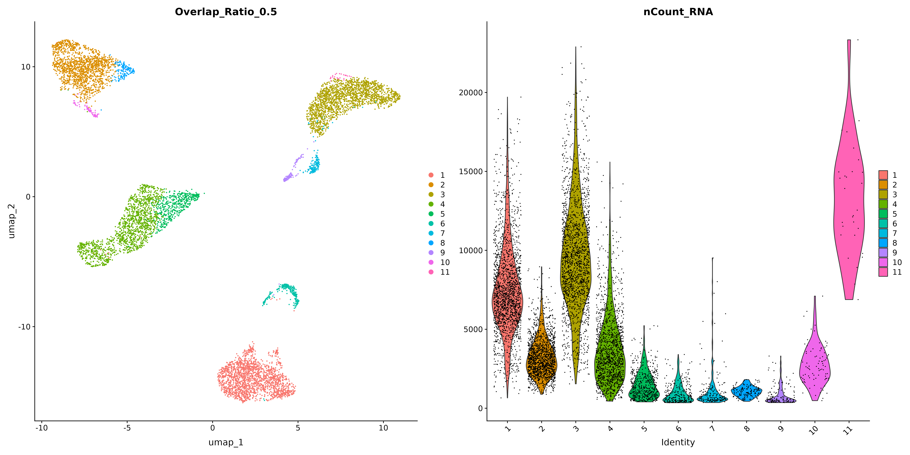

# scCLINIC: single-cell CLeaner: Identify aNd Interpret Contaminations

scCLINIC is an R package that identifies potential artifacts in single-cell RNA sequencing data (including doublets, multiplets and local contamination) and suggests potential source(s) of these artifacts. scCLINIC was developed with Seurat (https://satijalab.org/seurat/).

Artifacts can arise from dying or lysed cells, incomplete cell dissociation or from doublet/multiplet formation in droplet microfluidics or microwell systems, however, currently available algorithms insufficiently model multiplets and partial artifacts contributed by both global and local contamination patterns, failing to interpret their biological origins leading to incongruent marker genes and erroneous biological interpretations. To address these limitations, we introduce **scCLINIC (single-cell CLeaner: Identify aNd Interpret Contaminations)**, an iterative feature extraction tool designed to detect and interpret artifacts at the global and local levels by quantifying gene-level signatures and inferring their cellular sources without any reference. scCLINIC outperforms existing doublet detection methods in simulated and real-world datasets, especially at low contamination levels, and provides biologically grounded evidence confirming artifact identities in both solid and fluid tissues. Leveraging spatial transcriptomics, scCLINIC validates that partial artifacts reflect spatial proximity and repurposes contamination patterns to identify cell-cell interactions, offering novel insight into tissue architecture. 

The *scCLINIC* manuscript is currently available as a preprint on **bioRxiv**, which can be accessed [here](LINK). This GitHub repository contains the tutorial for *scCLINIC*. If you are looking for the the reproducible code used to generate the main figures presented in the manuscript, please visit the official repository at [https://github.com/JayShinLab/scCLINIC_manuscript](https://github.com/JayShinLab/scCLINIC_manuscript).

# scCLINIC Overview

scCLINIC workflow comprises of two steps:

(1) detect cell clusters with low identity and exclude them from analysis and

(2) identify artifact cell clusters and ascertain the contamination source(s).


**Figure 1.** Detection of artifacts in single-cell analysis and scCLINIC framework
**(A)** Identifying artifact types in single-cell analysis. Intact cells or cell debris before or during tissue dissociation may remain attached to their neighboring cells within the tissue and can subsequently be captured during scRNA-seq processing. The main cell type, shown in yellow, includes varying proportions of artifacts, depicted in green. Artifacts range from singlets (0% artifacts) to doublets (100% artifacts). Existing tools focus on detecting doublets, while scCLINIC detects all artifact types. 
**(B)** scCLINIC initial clustering and quality control. In Step 1, scCLINIC clusters the post-QC Seurat object at high resolution and merges clusters into major clusters, highlighted with dotted lines, based on the percentage of overlapping markers. In Step 2, it then identifies markers to calculate the Identity Score (IS) for each major cluster, filtering out clusters with low IS, depicted in grey. Step 3, scCLINIC subsets and re-clusters each major cluster to detect artifact subclusters. In Step 4, scCLINIC calculates a score for each subcluster using the expression levels of major cluster markers and their Enrichment Scores from the major clusters. These scores are displayed in multi-column plots. In Step 5, scCLINIC identifies artifact genes that are spuriously expressed in subclusters. Figure created with BioRender.com.

scCLINIC takes in either the post-QC Seurat object (using standard single-cell pre-processing workflows) **(Step1A)** or post-clustering Seurat objects after cell-type clustering and removal of low quality cells **(Step1C)**.

In this tutorial, we implement scCLINIC on a CITE-seq dataset from the following source:  https://satijalab.org/seurat/articles/hashing_vignette.html#hto-dataset-from-four-human-cell-lines 

Data represent single cells collected from four cell lines: HEK, K562, KG1 and THP1
Each cell line was further split into three samples (12 samples in total).
Each sample was labeled with a hashing antibody mixture (CD29 and CD45), pooled, and run on a single lane of 10X.
Based on this design, we should be able to detect doublets both across and within cell types

## Installation (in R/RStudio)

```R
remotes::install_github('JayShinLab/main')
```

## Dependencies

scCLINIC was built using following package versions: 

* Seurat (4.9.9.9060) 
* dplyr (1.1.3)
* pracma (2.4.2)
* ggplot2 (3.4.4)
* gridExtra (2.3) 
* reshape2 (1.4.4) 
* viridisLite (0.4.2) 
* pheatmap (1.0.12) 
* tidyr (1.3.1) 
* cowplot (1.1.1) 
* R.utils (2.12.2)
* fs (1.6.3)

## Input and Output

* **Name** Name of Run, name of output folder
* **Input** Input Directory of original Seurat Object
* **Output** Output Directory of scCLINIC Results

## Params

scCLINIC takes the following arguments:

* **resol** Step1A: FindClusters resolution for initial clustering in Step1, default using Seurat FindClusters default resolution: 0.8
* **overlapRatioList** Step1B: The overlap ratio to try in Step1B (recommended range: 0.1 to 0.6)
* **OverlapRatio** Step1C: The overlap ratio to carry forward to Step1C, default using 0.5, decrease to have coarse resolution
* **ISThreshold** Step1D: The threshold for Indentity Score (IS) to classify low quality cells, default using 0.
* **gene_n** Step2A: Number of markers to calculated, default using 150.

For pre-process Seurat object with clustering annotations

* **OverlapRatio** column name in the seurat object metadata which used for "annotation"
* **CELLANNOTATION** set to TRUE if using user cluster annotation

## A quick start
```R
library(scCLINIC)
obj <- load_data()
#1. Without user Annotation
scCLINIC_Main_Function("scCLINIC_test",obj,"~/scCLINIC_test/test1/") 
#replace "~/user/output/" with the directory to store scCLINIC result

#2. Using user annotation OverlapRatio = "HTO_CellType"
scCLINIC_Main_Function("scCLINIC_test",obj,"~/scCLINIC_test/test1/", OverlapRatio = "HTO_CellType",CELLANNOTATION = TRUE)

#Note: In scCLINIC_Main_Function, set parameter rm_tmp = TRUE to clear the temporary files
```

## Step-by-step for 1. Without user annotation

```R
library(scCLINIC)
library(dplyr)
library(pracma)
library(Seurat)
library(ggplot2)
library(tidyr)
library(pheatmap)
library(viridisLite)
library(reshape2)
library(gridExtra)
library(cowplot)
library(R.utils)
library(fs)

Name <- "scCLINIC_test"
Input <- load_data()
Output <- "~/scCLINIC_test/test1/"
resol=0.8
overlapRatioList=c(0.1,0.25,0.5,0.75,0.9)
OverlapRatio=0.25
ISThreshold=0
gene_n=150

obj <- STEP1A_GlobalMarkers(Input,Output,Name,resol)
obj <- STEP1B_MergingCluster(obj,Output,Name,resol,overlapRatioList,gene_n)
obj <- STEP1C_RecalculateGlobalMarkers_IdentityScore(obj,Output,Name,resol,OverlapRatio,gene_n)
obj <- STEP1D_FilterLowISCluster(obj,Output,Name,resol,OverlapRatio,ISThreshold)
STEP2A_Subcluster(obj,Output,Name,resol,OverlapRatio,gene_n)
obj <- STEP2B_ContaminationScore(obj,Output,Name,resol,OverlapRatio,gene_n)
PlotContaminationPattern(obj,Output,Name,OverlapRatio)
```

## Step-by-step for 2. using user annotation

```R
library(scCLINIC)
library(dplyr)
library(pracma)
library(Seurat)
library(ggplot2)
library(tidyr)
library(pheatmap)
library(viridisLite)
library(reshape2)
library(gridExtra)
library(cowplot)
library(R.utils)
library(fs)

Name <- "scCLINIC_test"
Output <- "~/scCLINIC_test/test1/"
resol="Manual"
OverlapRatio="HTO_CellType"
ISThreshold = 0
gene_n=150
CELLANNOTATION = TRUE

obj <- load_data()
obj <- STEP1C_RecalculateGlobalMarkers_IdentityScore(obj,Output,Name,resol,OverlapRatio,gene_n,CELLANNOTATION = TRUE)
obj <- STEP1D_FilterLowISCluster(obj,Output,Name,resol,OverlapRatio,ISThreshold,CELLANNOTATION = TRUE)
STEP2A_Subcluster(obj,Output,Name,resol,OverlapRatio,gene_n,CELLANNOTATION = TRUE)
obj <- STEP2B_ContaminationScore(obj,Output,Name,resol,OverlapRatio,gene_n,CELLANNOTATION = TRUE)
PlotContaminationPattern(obj,Output,Name,OverlapRatio,CELLANNOTATION = TRUE)
```
In the following sections, we used the result of **Step-by-step for 1. Without user annotation** to breakdown and illustrate each scCLINIC steps.

## Step1A

- With input of post-QC Seurat object, scCLINIC begins with clustering cells at high resolution and identifying marker genes for each cluster.
- Clustering result visualized in Figure 2 (filename with prefix 1a)

<p align="center">
  
</p>

**Figure 2.** Standard Seurat clustering with 0.8 resolution.

## Step1B

- scCLINIC will then merge clusters with high percentage of overlapping marker genes into Major Clusters, using a default threshold of 50% overlap.
- Users can adjust the threshold based on their specific datasets. For instance, a lower threshold can be set for less heterogeneous datasets, such as cell line datasets with fewer overlapping marker genes.
- Merging result visualized in Figure 3 (filename with prefix 1b, end with the threshold ratio, eg. 0.5 = 50% threshold)


**Figure 3A.** scCLINIC identified CITE-seq Major Clusters with 75% overlap ratio


**Figure 3B.** scCLINIC identified CITE-seq Major Clusters with 50% overlap ratio


**Figure 3C.** scCLINIC identified CITE-seq Major Clusters with 25% overlap ratio

In this tutorial, by comparing the UMAPs for 25%, 50% and 75%, we have chosen a 25% overlap ratio to carry forward because we anticipate identifying four major clusters.

## Step1C

- Users can perform their own cell-type clustering and skip steps 1A and 1B and directly proceed with Step1C. 
- scCLINIC calculates an **Identity Score (IS)** for each Major Cluster by averaging the **Differential Percentage Expression (DPE)** for each marker gene (difference between the percentage cell expression in the major cluster (pct.1) and all other cells (pct.2)). 
- Identity Score of each major clusters indicated in Table 1 (csv filename with prefix 1c and subfix IdentityScore)

**Table 1**

| Cluster | IdentityScore   | No. Cell       | Avg_Exp         | Avg_Exp_Others| avg_log2FC    |
| :-----: | :-------------: | :------------: | :-------------: | :-----------: | :-----------: |
| M1      | 0.53            | 1913           |2.04             |0.17           |2.34           |
| M2      | 0.35            | 1812           |2.24             |0.35           |2.56           |
| M3      | 0.61            | 1895           |5.79             |0.32           |2.57           |
| M4      | 0.32            | 1997           |1.11             |0.17           |2.74           |
| M5      | -0.20           | 257            |0.47             |1.41           |0.49           |
| M6      | -0.12           | 179            |1.56             |2.36           |0.76           |
| M7      | -0.22           | 140            |0.47             |1.37           |0.42           |

scCLINIC performed high resolution clustering, cluster merging, and identified Major Clusters 5 (M5), M6, and M7 as low-identity clusters with lower proportion of cells expressing marker genes compared to other clusters (**Table 1**), indicating that the cells are likely to be cell debris or ambient RNA. These clusters corresponded to cells that were negative (droplets without antibodies) for CITE-seq hashtag oligos (**Fig. 4**).

<p align="center">
  
</p>

**Figure 4.** CITE-Seq cell hashing dataset with barcoded antibodies. CITE-seq labels heterotypic and homotypic doublets, and "Negative" for droplets without antibodies.

## Step1D

- Major clusters with low IS, below a default threshold of 0, are likely to be low quality cell clusters and will be excluded from analysis. Users can modify the threshold to be more lenient or stringent depending on the quality of their datasets.
- Major clusters after thresholding visualized in Figure 5 (filename with prefix 1d)

<p align="center">
  
</p>

**Figure 5.** CITE-seq dataset UMAP after removing low IS clusters, M5, M6 and M7.

## Step2A

- After removing cells with low identity, scCLINIC subsets and re-clusters each major cluster into subclusters. 
- The union of marker genes from all major clusters are used as the variable features for PCA and clustering, using a default resolution of 1.5. 

## Step2B

- scCLINIC calculates a **Cluster Contribution Score (CCS)** and **scCLINIC Score (CS)** for each subcluster. 
  - The **Enrichment Score (ES)** of marker genes from other Major Clusters is calculated, comparing between the subcluster and other cells within the same Major Cluster. ES = avg_log2FC*(pct.1-pct.2). 
  - The **scCLINIC Score (CS)** for each subcluster is calculated by averaging the ES of marker genes from other major clusters. 
  - **Cluster Contribution Scores (CCS)** are calculated by averaging the ES of marker genes from each major cluster. 
- The sum of CCS from all major clusters may be higher than the CS because there may be marker genes shared between multiple major clusters.
- Subclusters will be ranked on an elbow plot according to their contamination score, multiple elbow points will be calculated and subclusters will be classified as different subclusters contamination levels based on the elbow points.
- We recommend selecting an optimal subclusters contamination levels to classify subclusters as "Artifact" or "Singlet." Details on how to achieve this are provided in the following section.
- In **Figure 6**, the first and second optimal subclusters contamination levels suggested by scCLINIC are highlighted in light red and dark red, respectively.


**Figure 6.** Elbow curve of scCLINIC Score vs. Number of Cells: elbow point cutoff (dotted line). 1 to 7 subclusters contamination levels, 1: Highest and 7: Lowest contamination. The first and second optimal contamination levels suggested by scCLINIC are highlighted in light red and dark red, respectively.

- scCLINIC will tabulate the contamination information, including the putative artifact genes, potential major cluster source(s), and the expression levels/profiles (e.g. avgLogFC, pct.1 and pct.2) of these genes.
- Artifact subclusters can be manually validated by users based on biological knowledge, with the help of interpretable artifact information, and subsequently removed for downstream analysis.

## Result (in Output folder)

- Step2B return a Seurat object including the scCLINIC Score (scCLINICScore), Subclusters contamination levels (scCLINIC_Level), and subclusters ID (scCLINIC_ClusterID) which stored as scCLINICResult.rds
- Based on **Figure 6**, we classify subclusters with a scCLINIC level of 3 or higher as "Singlet" and those with a level below 3 as "Artifact." The following code snippet performs this classification:

```R
#Modify the singletlevel to the scCLINIC level at which to classify subclusters as "Singlet."
singletlevel <- 3
obj$scCLINIC_artifact <- ifelse(as.numeric(levels(obj$scCLINIC_Level))[obj$scCLINIC_Level]<singletlevel,"Artifact","Singlet")
```

- [ArtifactsInfo.csv](example_output/ArtifactsInfo.csv) file including the information for each artifact genes, the subclusters they contaminated and their source of artifacts. 

- In **Figure 7** and **Figure 8**, we can visualize scCLINIC results in Major Cluster and Subcluster levels, respectively.


**Figure 7.** scCLINIC Major Cluster ID (Overlap_Ratio_0.25), Subclusters contamination levels (scCLINIC_Level: 1 to 7 contamination levels) and scCLINIC score.


**Figure 8.** scCLINIC Subcluster ID, Subclusters contamination levels (scCLINIC_Level: 1 to 7 contamination levels) and scCLINIC score within Major Cluster 3 (M3).

## PlotContaminationPattern

- This section plots the scCLINIC score and CCS (Cluster Contamination Score) for each subcluster.


**Figure 9.** scCLINIC score and CCS for M3 subclusters, each column represent each source of artifacts (SoA) and the "Score" represent scCLINIC score.

- The CCS score contributions from different sources of artifacts are visualized for Major clusters and Subclusters in **Figure 10** and **Figure 11**, respectively.


**Figure 10.** CCS score contributions from different sources of artifacts across Major Clusters.


**Figure 11.** CCS score contributions from different sources of artifacts across subcluster M3.

## Reference
Stoeckius, M. et al. Cell Hashing with barcoded antibodies enables multiplexing and doublet detection for single cell genomics. Genome Biol 19, 224 (2018).


